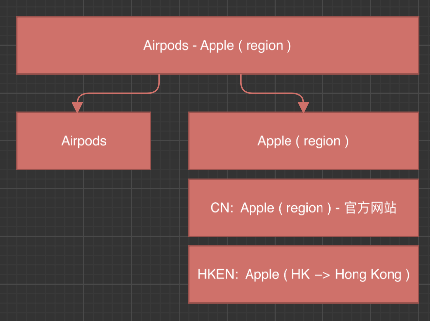

## Brief Tool
要点:
1. 下载后，edit mode 会自动关闭
2. 版本更新，添加v1, v2 ...
3. 在info中修改region为gc，在us下没有 specify locales 选项
4. Question: 是否要添加section？ @Sisi

标记分类:
- Content: 图片更新
- Design: 页面布局 layout 更新
- Copy: 在原文本上修改/删除/添加部分内容
- Code: 可以理解成这块的代码写法变了, eg: new copy; new section
- Remove: 删除

书写规范:
> 对应的语言标记，日期为系统添加。修改内容手动添加。
> 不同的地方加粗或者加下划线标记出来

Copy Update:
From:
**USB** to Gigabit Ethernet Adapter
To:
**Belkin USB** to Gigabit Ethernet Adapter

## Video & Animation training
1. 确认此 Video 在 /105/ 上的所有尺寸的**文件路径**，
2. 我们需要检查所有**尺寸**的 Video
3. 当我们**提交** Video 之后，需要 **GP查**，同时**QA查**，并且最终由**CPM确认**
4. Video需要**先于HTML文件merge**，merge 之后我们需要**检查所有尺寸文件**，避免merge 出错，例如覆盖目录导致删除了其他尺寸文件等

## Product knowledge
> Music, support, airpods, apple-pay, accessibility

需要知道的点:
1. 确认每个分类**是什么**以及其**位置**
2. 确认每个分类需要注意的点:
3. **MO 没有Homepod, Carplay, Google Nest，游戏机**

### Apple Music:
[All regions][apple-music]

确认分类以及位置时遇到的疑问:
1. live radio station **[ HK/TW/MO,~~CN~~ ]**
    - what: live radio 相关的图片和文本
    - where: 出现的位置有[a,b], **<-- Question: 是否是这两个位置！**
        - a: hero视频上的caption，
        - b: card component[radio]里的文本
    - 需要注意的点:

2. 好友歌单 **[ HK/TW/MO,~~CN~~ ]**  **<-- Question: 页面上哪里？**
    - what: **未在us/gc下搜索到关于好友歌单的字眼**，不确定具体指哪个区域，Matrix 上也没有截图指明
    - 需要注意的点:

3. 歌曲数量: **[ All ]**  **<-- Question: 页面上哪里？**
    - **what:**
    - **where**:
    - 需要注意的点: 需要本地化，**特别注意 HK,MO 的数量不同**。


4. 歌曲本地化:  **<-- Question: 是否是页面上出现在iPhone里的图片？,是否包括脚注中的引用**
    - what: 在页面中出现 Apple Music 应用图片时，里面的歌曲/专辑
    - where: 全局图片,脚注中也有可能出现，如：
                “《我的美丽》由 Mogu 和秦四风创作。
                《海上日记》由毛不易创作。”
    - 需要注意的点: **<-- Question: 看不懂表单上面的注释，https://music.apple.com/xx/**

5. Autobook: **<-- Question:找不到，在哪里**
    - what: 未在us/gc下搜索到关于好友歌单的字眼，不确定具体指哪个区域，Matrix 上也没有截图指明
    - 需要注意的点:

6. Hero Animation: **<-- Question:更新图片？**
     - 需要注意的点: 注意本地化

7. 支持裝置:
    - where: 整体页面下方
    - 需要注意的点: MO 没有 Homepod，Carplay，Google Nest，游戏机
                  CN 没有 TV, Google Nest
                  TW 没有 Google Nest。

8. 收费计划
    - where:支持装置上方
    - 需要注意的点: 价格可能有变化。

9. 歌单 **<-- Question:是否是what中提及的地方**
    - what: 全屏横向滚动的playlist图片
    - 需要注意的点: API 调用

10. 安卓下载页面 **<-- Question:找不到**
    - what: https://www.apple.com.cn/apple-music/android-download/
    - 需要注意的点: Mac, iOS 系统显示效果 和 安卓手机不一样，需要**单独查**。 （背景：中国不能打开 Google play）美国没有给 large，meduim 的 PSD, 所以保持原有样式。
    - 去哪里查

11. thank you 页面 **<-- Question:找不到**
     - what: 无法找到页面，这个页面在哪儿
     - 需要注意的点: 同上


### HomePod mini
[Not available in MO][homepod-mini]

1. Hey Siri: **<-- Question:BA是什么缩写，Siri utterance 是什么？**
    - Question: Siri utterance 由 BA 提供? 啥意思啊？

2. Multi-User: **<-- Question:是否是多人个性化区域**
    - gc 下没有这个section

3. Siri utterance **<-- Question:不知道想表达什么？**
    - 是要根据表格更新Hey Siri 在各个地区的显示的内容

4. Personal experience section
    - GC 下没有

5. 第三方 App 本地化 **<-- Question:同上 BA是啥，在CN页面没找到这个section**
    - 仅CN需要本地化，HK/MO/TW: 无
    - 排序也是 BA 确认的。
    - QA需要检查对应性。保证copy和icon的对应

6. system requirement **<-- Question:找不到**
    - 在哪儿？ 全局没搜索结果
    - HK/CN: 兼容 iOS 12.1.1 以后版本TW: 兼容 iOS 12.4 以后版本这个也是 BA 给的。

### Podcasts
[All regions][apple-podcasts]

1. 没有做 AOW **<-- Question:podcast层级下是否都没有做aow呢**
2. V path 不同于美国，但是 呈现效果要和美国相同，所以根据美国最新的效果 更新本地的 CSS.(如字体颜色，按钮颜色，设备颜色。)
3. API:
    1. Top Charts 美国 用的 API, GC 地区因为中国大陆对  API path 的限制，无法调用. 所以整个 GC 保持 V 版本是 A 的 code 结构, 手动排版的gallery， title 也保持 top shows. 美国的 V 版本已经更新到 C (2022-05).
    2. 节目内容由 BA 提供，包括图片、节目名称和 URL。因与美国不同，部分 code 是 dev 写的， 在 QA 阶段需要更多关注。

### Aiprods
[All regions][airpods]

1. 激光镌刻需要 Not available in MO, 需要注意: 镌刻文字 和 图案是否需要本地化.
2. 价格:

### Apple Pay
[All regions][apple-pay]
1. general: **<-- Question:文以难以读通，且不知道具体在那个页面，什么情况下会关注到该点，需要解释**
    - MO: 借記卡(debit cards)在商店及 app 內，透過 Face ID 以 iPhone 付款
    - HKTC: 在商店 app 內及網頁上，透過 FaceID以iPhone付款在Mac上以 Apple Pay 完成付款
    - MO 暫時不能在mac/網站上付款.MO 不能app支付和网上支付 支持ipad,当时只是需要换屏，所以第一轮没有更新


2. NFC 标志 **ALL** **<-- Question:表格中的三张图分别代表什么？**
    - 注意顺序，CN 标识不同
    - 中国大陆已经支持 NFC,
    - 亿通行 2021年6月28日上线，
    - 暂时overview页面没有让更新，因为要改版。

3. local nav **CN/HK**
    - Not available in TW/MO
    - CN 依次为首页,公交,适用范围
    - HK 概覽, 八達通, Octopus
    - 北京支持两种卡，另还支持亿通行app。广州、佛山有广佛卡可通用，广州还有一个 羊城卡。(2020.4.8上线版本)**<-- Question:在哪个区域改？是否是下面的卡片**

4. 公交卡 hero 動畫 **CN ONLY**
   - 設置了加載時間是 5秒，如果超過 5秒 圖片還沒有加載完，直接顯示靜態圖，不會再出現動畫效果。
   - 100張靜態圖組成，傳到 105 上的。
   - AOW 沒有動畫，

5. shosebox banner [打开钱包 app 添加交通卡] **CN/HK**
   - **只在 iphone 上顯示**，暫時 在頁面下方，开发时做过放在上面的。
   - **AOW 沒有 banner**，因為 shose box 在 wechat 瀏覽器不起作用。 所以 MOT 在 wechat 瀏覽器裡也是 隱藏掉的。
   - **MOT** 是什么？ **<-- Question:MOT是什么的缩写**

6. Transit Ribbon **CN ONLY**
   - 根据相关政策要求升级公交卡，增加 Ribbon + legal。上线时间 2022/Jul/1

7. AOW **CN ONLY**
       - nothing mentioned

8. Overview / banks **ALL** **<-- Question:需要解释一下关于Tap & Go的规则，是否只需要关注Tap & Go在哪里出现？**
     - 银行列表为字母顺序排列，
     - CN 为部分银行，HK/TW 为所有银行和机构
     - HK/HKEN 的 Apple Pay 首页中，合作银行部分有 Tap & Go , Banks 页面中没有 Tap & Go, 取而代之的是 HKT。--> 是因为 Tap & Go 是 HKT 银行所支持的机构，他们在各自的列表中按照各自的首字母排列https://www.apple.com/hk/apple-pay/banks/hk/zh-hk.html

9. Banks 页面 **ALL**
      - **HK 无 CN 版本**， 其他两种都有
      - 两个版本的顺序相同/数量相同。en-cn.html 只有 copy 是英文，中间列表依然是中文，区别于其他语言https://www.apple.com/tw/apple-pay/banks/tw/zh-tw.html
      - 页面上已有的银行信息，以页面为准，Numbers 上的不准。新添加的 银行信息，以 Numbers 为准。
      - 中国中文 ：https://www.apple.com/cn/apple-pay/banks/cn/zh-cn.html
      - 中国英文：https://www.apple.com/cn/apple-pay/banks/cn/en-cn.html

10. Support Url **ALL**

11. **V 和美國不同步，GC 暂时没有 Wallte, 不跟美国 V 和 Layout。**.


### Support

[All regions][/support/products/]

!! 产品页面美国每次都会给 Geo copy,  一般更新的 copy 会标成红色，如果没有标红色，以在线 copy 为主，因为美国 原英文会有错误。

!! HKEN, 切记 !!  country or region， 必须要加  or region， 美国提供的英文原文一般不会写。

1. AppleCare Protection Plan: **[Unable to locate]**
    - 只有Apple TV is called AppleCare Protection Plan，CN 无 Apple TV, :页面不出现 AppleCare Protection Plan.
2. AppleCare+: [all regions] [all local nav sites / overview]
3. Professional Page: **[Unable to locate]** [not available in MO]
4. Enterprise Support: [above addtional support] [not available in TW/MO]
5. Apple TV: [not available in CN]
6. HomePod: [not available in MO]
    - HomePod in one sub cate under Music
7. iPod:[all regions]
    - **iPod touch EOL, 但页面保留 [EOL: stands for?]**
8. how-to-buy: [all regions] [sub cate sites only]
    - 1，MO:英文原文 有兩條，Brand Team 讓刪除第二條
    - 1. ~~Or buy it within 60 days of your Apple Watch purchase:At an Apple Store (inspection of Apple Watch and proof of purchase are required)~~
9. footnote: [all regions]: 线上为准
10. 三包:[CN only] [overview and sub sites]
11. AppleCare Technican Training: **[unable to locate]**
    - CN,TW 課程不能單獨購買，所以刪除了購買的 copy 和 section。
12. Buy Button: [not available in TW / MO]
    - MO 不能在线购买，TW  不能在线购买 AC+,localnav 没有购买。
13. Dynamic Price: [not available in TW / MO] **[unable to locate]**
    - 只支持年付, 指的是 TW / MO 只支持年付吗？


### Accessibility

!! VO: [all regions]
!! 请提醒 Dev 和 Writer 使用 VO 工具检查 CopyQA 除了使用 VO 工具外，请在真机上实际读一遍 VO。注意 VO 与 Screen 匹配。

- **[unable to lacate]**
- **how to read this doc!**
- 18 new features / 19 existing features


- Besides the following, available in [regions]         [not availables]
    voice control spelling mode                         [cn/hk]
    live captions                                       [cn/hken/hk]
    lvie captions in facetime                           [cn/hken/hk]
    starting point detection with voice over maps       [cn/hken/hk]
    activities in magnifier                             [cn/hken/hk]
    add aduiograms to health                            [cn/hken/hk]
    addtional customization options for sound recognition[cn/hken/hk]
    eye-tracking support for iPadOS                     [cn/hken/hk]

    VoiceOver Recognition - text descriptions           [cn]
    Audio descriptions                                  [hk:keep for commu]


## AOW

### AOW vs MOW: 与AOW对应的页面是MOW页面
https://frontier.apple.com/reference/aow/wechat/
https://frontier.apple.com/reference/aow/wechat/page-validation-spec/

### General notes:
1. US: /internal/geo-alt/ gives reference
2. Animation: 是否添加参考美国
3. 位置：参考geo-alt中 aow 的位置 @sisi
    Resource	 Shared?	Location
    HTML	       N	      /internal/geo-alt/site-name/aow/
    CSS	       N	      /v/site-name/[version]/built/aow/styles/
    JS	       Y	      /v/site-name/[version]/built/scripts/
    Images	    Y	      /v/site-name/[version]/images/
    ac-assets	 Y	      /v/site-name/[version]/built/assets/
4. /v/ 的样式，如果美国没有 AOW 给写，在客户要求/知情的情况下，做页面是需要直接用 MOW 的样式。@sisi

### HTML (1)
1. hard coded
Add Class 'aow'
``` <html class="aow"> ```
### Head
INCs
#### Meta tags (2)
1. og:url reflects aow url```https://www.apple.com/cn/macbook-air/aow/features/```
2. og:image
    Same as MOW page
#### web fonts (1)
Hard Coded:
```
<link rel="stylesheet" href="/wss/fonts?families=SF+Pro+Icons,v1" />
```
#### Style links(3)
Add '/aow': us(built.css) cn(image.css & built.css)
```
<link rel="stylesheet" href="/v/airpods/r/built/aow/overview.built.css" type="text/css" />
<link rel="stylesheet" href="/airpods/aow/styles/overview.built.css" type="text/css" />
<link rel="stylesheet" href="/airpods/aow/styles/overview.images.css" type="text/css" />
```

### Body
#### Wechat's OG
- hard coded
- First element of body, inline style with the display none.
    ```
    <div style="display:none;">
        
    </div>
    ```
#### Global Nav & Relevants
- HTML:INC
- CSS: INC
#### Local Nav
- HTML: Normal localization process
- CSS: INC
### Footer
- CSS: INC
- wechat footer actions = QR: INC
- buyStrip: INC
- Breadcrumbs: hard coded, removed!
- directory: INC (part of global footer)
- WeChat legal lines: Hard Coded!
- WeChat global footer : INC

### Inc templates

> 1. Add variable (2)
> 2. Add inc for qr code html(1)
> 3. Add inc for wechat footer html(1)

> 4. Remove buystrip inc (2)
> 5. Remove inc for global nav html(1)
> 6. Remove global footer (1)
#### Head
**Add**:
```
// set site id value
<!--#set var="AC_AOW_PAGE" value="true"-->
<!--#set var="AC_WECHAT_PAGE" value="true"-->
```
same:

1. set time format:
```
<!--#include virtual="/ac/includes/use-date.inc"-->
```
2. manage compaigns:
```
<!--#include virtual="/ac/includes/campaigns/holiday-2021/vars.inc"-->
```
3. links one layer deeper to  head.inc: what it does is: set canonical/hreflang/cross
```
<!--#include virtual="/ac/includes/head-sf.inc"-->
```
4.manage device size and flex setting
```
<!--#include virtual="/ac/includes/viewport.fluid.cover.inc"-->
```

5. set aow/mow styles
  - [global nav].built.css
  - [local nav].built.css
  - [global footer].built.css
  - [wechat footer].built.css
```
<!--#include virtual="/ac/includes/styles.inc"-->
```
6. set variable for hostname
```
<!--#set var="AC_PRICING_API_HOSTNAME" value="https://www.apple.com.cn" -->
```
7. price related
```
<!--#include virtual="/ac/includes/pricing/1/meta.inc"-->
```
8. sets analytics-s-bucket#
```
<!--#include virtual="/metrics/ac-analytics/meta/airpodsagnostic.inc"-->
```


#### Body
**Remove**:
1. Sets locale & global nav html and js
```
<!--#include virtual="/ac/includes/globalnav.inc"-->
```
Same:

1. load latest javascript scripts
```<!--#include virtual="/metrics/ac-analytics/includes/auto-init.inc"--> ```

**Edit**:
1. load aow/mow html templates
```<!--#include virtual="/airpods/shared/compare/aow/compare.inc"--> ```

#### Footer
**Add**:
1. loads qr code
```
<!--#include virtual="${AC_WECHATFOOTER_ASSET_PATH}/actions.inc"-->
```
2.loads wechat footer html
```
<!--#include virtual="${AC_WECHATFOOTER_ASSET_PATH}/footer.inc"-->
```
**Remove**:

1. set section value to buystrip
```
<!--#set var="BUYSTRIP_CHAT_TOKEN" value="/airpods/"-->
```
2. buystrip html
```
<!--#include virtual="/airpods/shared/compare/airpods-buystrip.inc"-->
```
3. loads global footer html and javascript
```
<!--#include virtual="/ac/includes/globalfooter.inc" -->
```


### Link rules & Examples
1. Intra-site link : point to inner /ipnone-x/ --> /ipnone-x/...
```
/macbook-air/
/macbook-air/aow/
```
2. AOS/buy link : /shop/goto/
```
/cn/shop/goto/macbookair
https://web.mmap.apple.com/cn/shop/goto/macbookair
```

3. external link: non *.apple.com
```
[ keep original ]
```

4. Redirects:
    - Inter-site link : point to outer /ipnone-x/ ---> /apple.com/
    - marcom link: www.xxxx.com/iphone/homepad
    - Partner link: https://support.apple.com/,https://developer.apple.com/
    - serach link: points to marcom search link: /search/macbook
```
https://web.mmap.apple.com/mhm/p/wechat/redirect?url=
```
## Server & URLs
1. 写出命令: 使用terminal 安装docker
2. 写出命令: 使用terminal 安装 idk-ic-local
3. 写出命令: 使用terminal 启动 trunk
   写出命令: 使用terminal 启动 webedit
4. 写出命令: 使用terminal 终止 local server
5. 写出地址: 在 [browser]中打开某[branch/trunk]下的某环境[preview/local] 下的 某地区下的 [tw/hk/mo/.cn]的 [/..(.cn)/.../(aow/)]
   写出地址: workshop中制定的url:
```
brew cask install docker
brew install docker
brew install idk-ic-local
ic-local start classic ictrunk
ic-local start classic webedit
ic-local stop
ic-local stop [xxx]
------
webedit.preview.apple.com.cn/airpods/
webedit.ic-local.apple.com.cn/airpods/
ic10.preview.apple.com/tw/iphone/
ic10.ic-local.apple.com/hk/en/iphone/
ictrunk.preview.apple.com/hk/en/iphone/
ictrunk.ic-local.apple.com.cn/airpods/aow/
www-push-view.apple.com
www-push-view.isww.apple.com
www-push-view.apple.com/mo
www-push-view.isww.apple.com.cn/xx
```

## Image Localization
Q: 描述在 HTML/CSS 文件中图片本地化的流程:
> 本地化图片在前几年的时候，GC 所有语言都需要本地化。后来，
>HKEN/HKTC/MO 的图大部分可以直接用美国，只有少部分需要本地化。
>CN/TW 的图仍需要做较多的本地化工作。

A: 修改步骤:
	1. 根据美国路径中对应的图片的路径，在相对的文件下放入图片
	2. 修改 path的rules: a.参考美国 b.remove v & f(版本号)
	3. 检查，提交，告知 PM/GP

A+: 注意点：
	4. 和美国保持一致
	5. styles folder 下有专门的 xxx.images.css 文件管理图片的样式
	6. 如果图片尺寸不同，则修改否则不修改
	7. lint： and( -> and ( ,导致safari 下 2x 调取失败
	8. style link placement:  us/built > cn/built > cn/images

## Font & Text
Q: 在什么时候会调用pingfang字体？
   澳门的调用字体是什么？
   大陆的调用字体是什么？
   香港——中文的调用字体是什么？
   台湾的字体调用是什么？

A: 所有地区的页面中都要使用 EN fonts 以及其备用 font，且英文的fonts 分为标题和文本两类，区分使用
   所有地区的页面中都要使用 icon fonts
   中文（三种：简体/台湾/香港）没有澳门，
   当当前页面中的字体出现确实的情况，会调用系统字体
   因为gc页面中也有英文，因此也需要调用英文的
   缺字：单独再引用一次:x + 位置/大小调整 + 上报 PM/字体团队
   QA tool 检查 / 肉眼可见，缺字的比较大
```HTML
    <span class="pingfang">铥铥</span>
```
``` CSS
.typography-show-title-copy span.pingfang:lang(zh-CN) {
    font-family: 'PingFang SC', 'Helvetica Neue', 'Helvetica', 'Arial', sans-serif;
    font-size: 12px;
    position: relative;
    top: -1px;
}

@media only screen and (max-width: 734px) {
	.typography-show-title-copy span.pingfang:lang(zh-CN) {
		font-size: 10px;
	}
}

```

Q: 有两种方法实现去掉标点居中的效果,如何实现？
	1. 脱离文本流
	    ```position:absolute```
	2. add class cl_xx
		```
		html[lang=zh-HK] .cl_05{
			padding-left: 0.5em;
		}
		```

Q: 避免单字单行/特殊[短语/句子/链接]不换行如何实现？）
   参考：Development/applecom/gc/trunk/hk/global/styles/sfpro-hk.css
A: 常见的有 br 调整和为需要的词添加 span 方法等。
```
<h2 class="intro-headline typography-grid-headline">The simplicity
    <p>
    The simplicity of&nbsp;Apple.<br>of Apple.In&nbsp;a&nbsp;credit card.
    </p>
</h2>
```

一些注意点：
1. 空格与括号等符号是英文的
2. 标点符号、角标不能出现在段落开头。

## Grid
Q:在 large,medium,small 适配，写出在大中小屏幕中各种class的用法。[Grid
](https://standards.apple.com/system-library/#pattern-grid)
Q:在某元素上用什么classname可以使其在a.大屏幕上占比2/3 b.中屏占比1/2, c. 小屏占比100%。
Q:在某元素上用什么classname可以使其在a.大屏幕上居中等
```
.large-6 medium-8 small-12
.*-grow
.*-centered
.*-offset-#
.*-(order)-#
.*-(order)-0
.*-last
.row > .column > .row > .column
.justify-content-[start/end/center/spacebetween/spacearound]
.align-items-[start/end/center]
.align-self-[start|center|end]
.row-reverse
```

## Commands - IDK setup & update file structure
1. 设置idk文件里默认地区和语言 idk/.config  [IDK_LOCALE] [AC_REGION] [AC_COUNTRY] [AC_COUNTRIES]
```
	export IDK_LOCALE='en_US,en_HK,zh_CN,zh_HK,zh_MO,zh_TW'
	export AC_REGION='gc'
	export AC_COUNTRY='/'
	export AC_COUNTRIES='cn hk hk/en tw mo'
```

2. 拉取 applecom 主目录  [**watcout**: url ends with applecom, not applecom/] [**watchout**: it is --depth not --set-depth in svn co]
	```svn co [url] applecom --depth immediates```

3. set up file structures		[**watchout** hk/en] [use 'svn list / svn ls 'to help check the repo's file structure]
	```
	svn update —set-depth immediates
	svn update —set-depth infinity
	svn update —set-depth empty
	```

4. update icxx/webedit's style files + [各个文件下样式文件的位置以及命名] + [别忘记：hk/en/global]+ [global-cn]
	```
	svn update cn/global-cn/ hk/global/ hk/en/global/ mo/global/ tw/global/ --set-depth infinity
	```

5. 同时更新gc和us
	```sco classic [trunk/branch] [folder name]```

6. apple-denali
	```sco classic [xx] [xx]```

## Commands - merge
```
svn st 			 						: check local changes
svn cleanup					 			: solve locked error
cmd1 && cmd2 && cmd3					: multi commands
svn delete (del, remove, rm) 			: Delete an item from a working copy or the repository.
svn commit -m '...' | svn ci			: Send changes from your working copy to the repository.	[SomeOne ask to _added_ _xxx_ on _webedit_ for _HKEN_ by Sisi.]
```

```
svn merge -r 929585: 972838 ~/Development/applecom/gc/trunk/cn/music/ --accept tf
svn merge ~/Development/applecom/gc/branches/ic65/hk/en/ipad hk/en/ipad -- accept tf
```
```
svn resolve -R --accept='working'   [srr]
svn revert -R .```                  [sre]
```
```
review -r [2461589]             : code difference
radar [2461589]                 : file and url changes
node contact.js [2466620]       : image changes

```
## Radar reply

> rdar://93567483 (APPROVAL | Apple Music Live Homepage Tile for Harry Styles (5/20-5/21))
>
> Merged from ic60 to trunk for HK/MO/TW.
>
> Revision(s): 2419949
>
> File(s) modified on trunk:
> Modified_files_r2419949
>
> ContactSheet attached: GC_images-for-r2419949.pdf
> No images added.
>
> Preview URL(s):
>   !!need to modify, the exported format is the file path not url!!
>
> someone asked to add xxxx.image onwebedit for hk/en/mo/tw/hken by me
> someone asked to add xxxx.image onwebedit for @xxx-radar-xxx by me


## HTML localization
### workflow
1. lang attr : fomat is zh-CN
2. locale : format is zh_CN
3. - variable in title & og:site_name: ```var='GEO_pageTitleSuffix'``` ``` var='GEO_homePageTitle' ```
4. links [font. text. built. images, ie]
    - Link: Rules in HTML localization:
    - Font: ```href='/wss/....SF+Pro+[SC/TC/HK]' ```
    - Text: ```href='/[tw/mo/hk/global-cn]/global/styles/sfpro-[tw/mo/hk/cn].css'``` cn* global-cn
    - Built: ```href="[hk/hk\/en/mo/tw/'']/apple-music/styles/overview.built.css"```cn* without the local 'cn/'
    - Images: ```href="[hk/hk\/en/mo/tw/'']/apple-music/styles/overview.images.css" ```* cn* without the local 'cn/'
    - IE: ```<!--[if IE]>....<![endif]-->```
5. OGs and name properties 
    - image: upon request
    - title: [CHAOS]
    - og:title: [CHAOS]
    - og:site_name: [CHAOS]
    - og: description =  ```name="Description" ```
    - locale: ```property="og:locale" content="zh_HK"```
    - og:url: link back to itself 
    - ```name="Description"```'s Value = ```property="og:description" ```'s Value
6. Others: 
    - f. 注脚不用在这一步做
    - g. 删除段落也不是在这一步做，比如删除 apple-tv section
    - h. 注脚不用在这一步做
    - i. vo 也不要在这一步做
    - j. support link : confirm link is working / contact pm /
    - k. json link: confirm with pm / keep us version
    - l. pdf:confirm with pm
    - x. do not change: built file's url

### title chaos
> title = og: title + og:site_name
>
> Keywords: **(中国大陆) - 官方网站** | **HK** |  **Hong Kong**
> 
> HKEN: on **[Product sites**'] [og:site_name and title]: **Apple (HK)**
> HKEN: on [**Homepage**] All is called **Apple (Hong Kong)**
- On product sites, it follows the following rules with two exceptions on CN / HKEN! 
-  **title = og:title + og:site_name**        


- On homepage, the title / og: title / og: site_name has the same value!
    - US: Apple
    - CN: Apple (中国大陆) - 官方网站
    - TW: Apple (台灣)
    - MO: Apple (澳門)
    - HKEN: Apple (Hong Kong) 

## Tools
### beyond compare install and config
	- usage: compare file structure -> file content
	- usage: compare with us / check with preset rules

### qa tool
	git clone xxxxx
	npm install
	npm run start
	localhost: xxxxx
	od auth

### Sublime linter
Compress code in Sublime -> cmd + shift + J
Format Compressed code in Sublime --> right click -> prettify -> prettify


## Bits
- ignore puncation (,)
- half space (6x)
- no-wrap (2+ words at the end of the sentence)
- AirPods AR section : portal for experience vr is only available in mobile devices. ```open -a simulator```: iphone display simulator
- css file
	- built.css    	: us
	- overview.css 	: layouts
	- image.css  		: images-rel
	- sfproxx.css   	: text-rel
- ?debugging: (product/compare page ONLY)
		add after the url
		exports backport.hbs(most used: export---> compress----> replace) and json file
- links: beside cn, others need to change rel path
		   aow path is different than others
- footnote matching
	- '* / + ' ignore order/ place on top
	-  generic footnote placed at the bottom of the list
- option + space in sublime / &nbps  eg: itunes Store
- voice over labels:
	- aria-label:
	- visable-hidden:
	- data-aria-[xxxxx]
- .usdz file: AR file
	- not available on AOW pages, only Safari
- links:
	- CTA link: nav to apple online store team.
		- /hk-zh/
		- /hk/
		- .cn/shop/
		- mo: delete / only retail
	- Support link: Nav to page that's not done by our team
- global folder: change with caution
- DC VPN access required for webedit.preview.apple.com.cn
- $TRUNK points at server(sourcebox)
- Terminal error: mixed revision --> update file
- Review changes on versions before commit